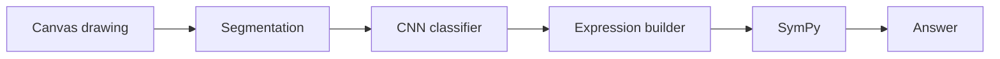
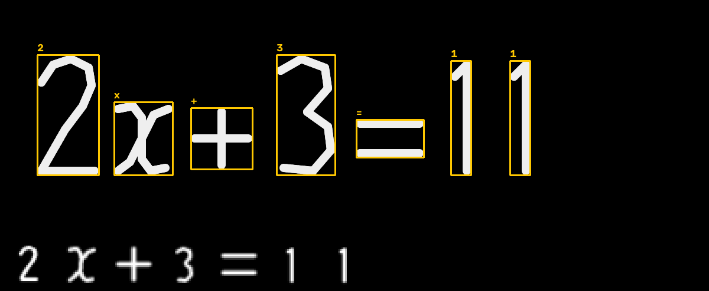
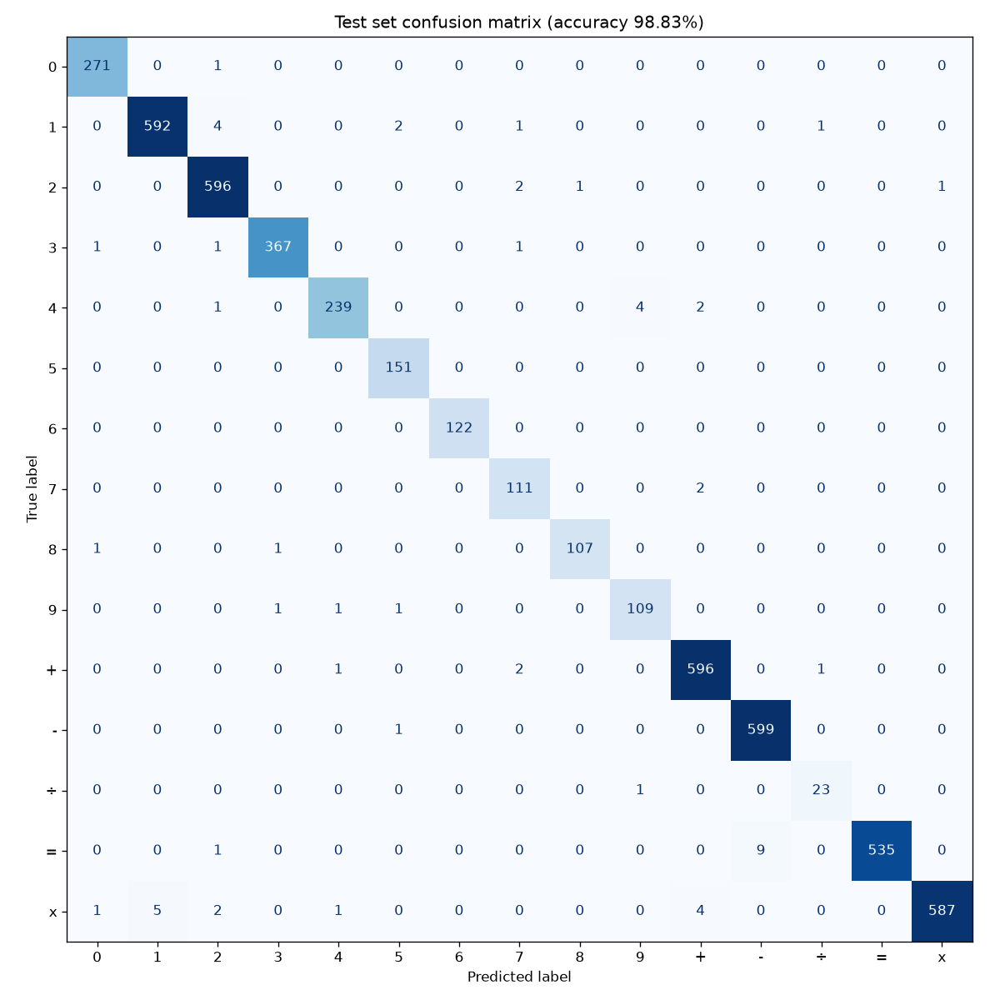
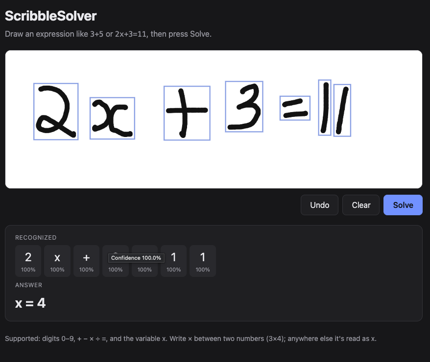
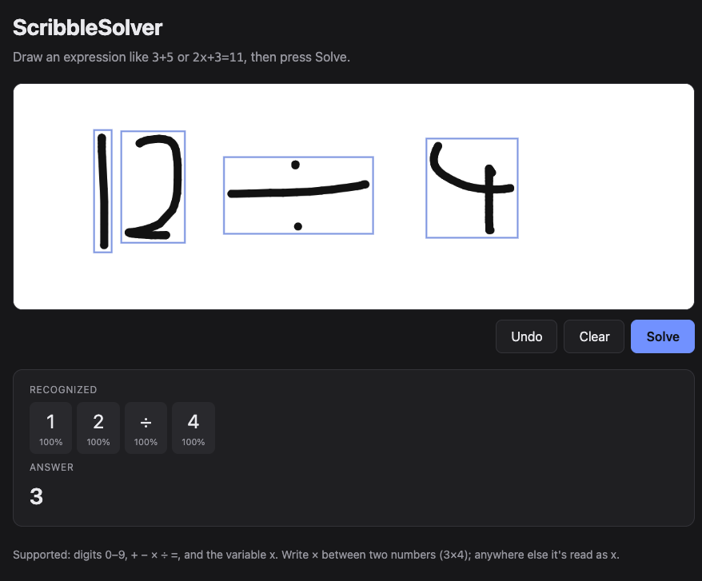
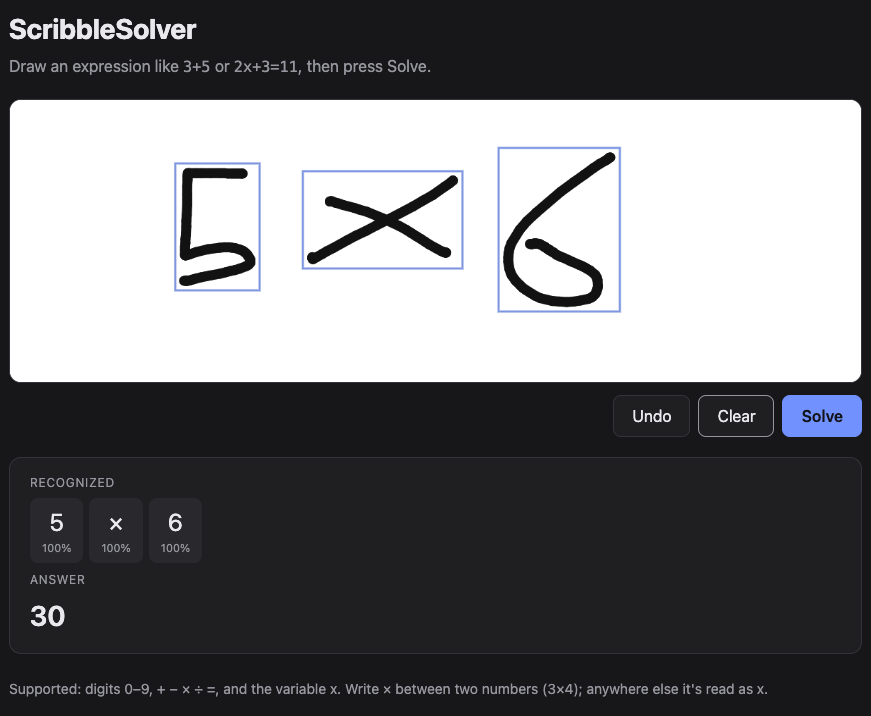
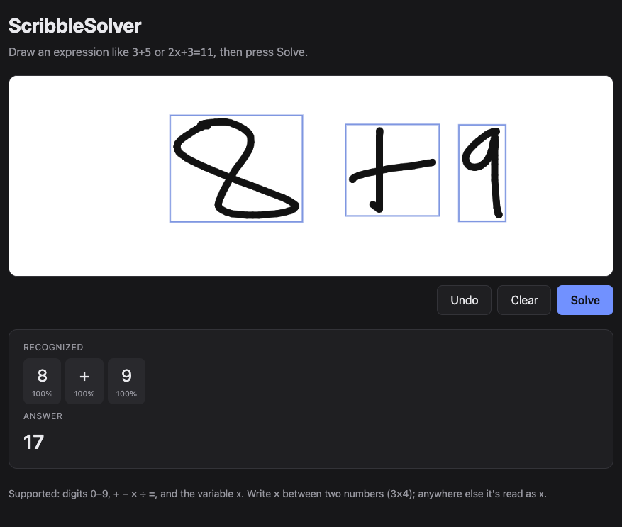
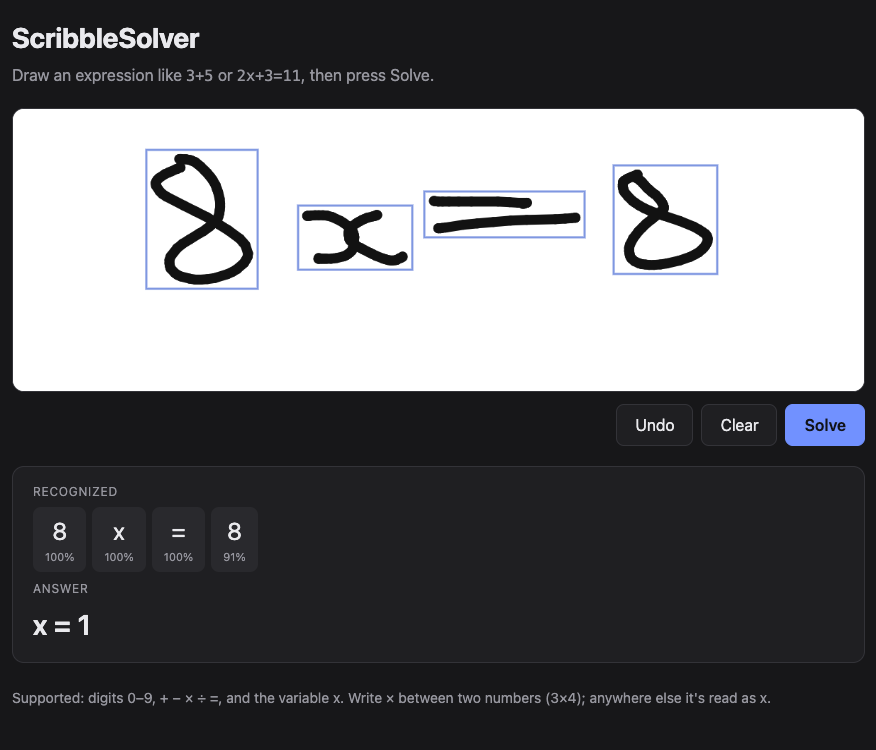
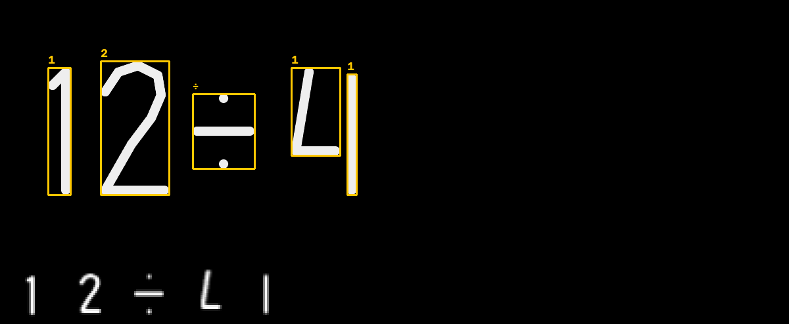

# SketchSolve

<p align="center">
  
</p>
<!-- TODO: record docs/images/demo.gif -->

By Bhishma Gaudani. Draw a math problem like `2x+3=11` on a canvas and it reads each handwritten symbol and solves it. It runs locally; see [Run it yourself](#run-it-yourself).

## Why I built this

This started as an MNIST digit recognizer with a Streamlit canvas: draw one digit, get a prediction. It worked, but one digit at a time felt like a toy, and I wanted to see if I could get from "what digit is this" to "read this whole line of math and solve it". The old app is still in [`legacy/`](legacy/).

## How it works



**Canvas.** Plain HTML/JS, no framework. When you hit Solve, the canvas is sent to a Flask endpoint (`POST /predict`) as a base64 PNG.

**Segmentation** ([src/segmentation.py](src/segmentation.py)). Threshold the image, find each blob of ink with `cv2.findContours`, and sort left to right. Parts of the same symbol sit above each other (the two lines of `=`, the dots of `÷`), so boxes that overlap more than 50% horizontally get merged. Each crop takes only its own ink, not everything inside its rectangle, because a slanted stroke from the neighbor can reach into the box. This is what the segmenter sees for `2x+3=11`, with the 28x28 image the model gets for each symbol along the bottom:



**CNN** ([src/model.py](src/model.py)). The same small network as my MNIST version (two conv+pool blocks, a 128-unit dense layer, 225,679 parameters), with Dropout and light augmentation added. The augmentation is small on purpose: ±10° rotation, 10% shift and zoom, no flips. Rotate `+` by 45° and you get `×`; rotate `-` by 90° and you get `1`; mirror a `2` and it's not a digit anymore. It knows 15 classes: 0–9, `+ - ÷ =` and one x-shaped class that covers both `x` and `×` (explained below).

Every symbol, from the dataset or from the canvas, goes through the same preprocessing function ([src/preprocessing.py](src/preprocessing.py)): crop to the ink, thin strokes to 1 px and re-thicken them to a fixed width, fit into 20x20, pad to 28x28, and center by center of mass, the way MNIST was built. The thinning step matters because the dataset strokes are about 1 px wide and canvas strokes are thick.

**Expression builder** ([src/solver.py](src/solver.py)). Groups digits into numbers, adds the implicit `*` in `2x`, and decides what each x-shaped symbol means: with a number on both sides (`3x4`) it's times, anywhere else it's the variable. It also rejects things like `3××4` before they reach the parser, since that would otherwise become `3**4` (a power).

**SymPy.** No `=` means evaluate. With `=` it solves for x, or reports true/false if there's no x. `parse_expr` runs Python's `eval()` internally, so it only ever gets strings built from the model's fixed set of symbols, and anything else is rejected before parsing.

## Results

| Metric | Value |
|---|---|
| Per-symbol test accuracy (5,064 held-out images) | **98.83%** (5,005 correct) |
| Full-equation accuracy (1,000 synthetic equations, answer correct) | **87.40%** (874 correct) |
| Validation loss at the best epoch (30 of 35) | 0.0524 |

The two accuracy numbers answer different questions. An equation is only right if every symbol is right and segmentation found the right symbols. At 98.83% per symbol, a 6-symbol equation would already come out right only about 93% of the time (my eval script puts it at 93.53% averaged over the actual lengths). The rest of the gap is segmentation, which the single-image test can't see at all: 3.6% of equations failed because a symbol got split or merged.

The equations are synthetic: I stitched test-set symbol images side by side and ran them through the full app pipeline. Pen thickness turned out to matter, so I ran the same 1,000 equations at 5–13 px and got 84.30%–87.40%. 87.40% is the 9 px run, which matches the app's pen relative to symbol size. I haven't measured accuracy on real drawings from people yet (TODO). Full report: [docs/end_to_end.md](docs/end_to_end.md).

Class weighting comparison (validation set, from when × and x were still separate classes):

| Class weights | Val accuracy | × recall | × precision | x recall |
|---|---|---|---|---|
| None | 97.17% | 0.0% | n/a (never predicted ×) | 98.7% |
| Square root (used) | 97.11% | 27.8% | 50.0% | 95.2% |
| Balanced | 95.03% | 78.9% | 32.0% | 73.8% |

The best overall accuracy came from the model that never predicted × at all. Raw output: [docs/class_weight_experiment.md](docs/class_weight_experiment.md).



## Things I learned / problems I hit

**78% of the dataset was duplicates.** When I first ran my data prep script it printed files vs. unique images per class, and the numbers were way off: 197,183 files, only 43,408 unique. `÷` went from 868 files to 157 real images. I checked a few by hand and they were byte-identical copies under different names (`div_1011.jpg`, `exp1011.jpg`, `exp904.jpg`, `exp959.jpg`). If I hadn't removed them, most test images would have had an exact copy in training and the test score would have been meaningless.

**× and x can't be told apart by shape.** With them as separate classes, 148 of 600 test x's came out as ×. Changing the class weights just moved errors back and forth between the two (see the table above). The dataset's x folder has plenty of plain crosses in it, so the information isn't in the image. I merged them into one class and let the solver decide from the neighboring symbols.

**÷ had almost no data, and then a bug ate its dots.** With only 157 unique examples I used square-root class weights so the model doesn't ignore it. While putting this README together, a clean `12÷4` came back as `12=4`. The debug image showed the bottom dot was missing from the model's input: `cv2.ximgproc.thinning` had erased one solid dot completely and kept the other identical one. The fix puts back the center of any blob that thinning wipes out. The bug only hit solid dots like the canvas makes; rebuilding the dataset with the fix gave byte-identical splits, so the model and numbers didn't change.

**My original digit app didn't preprocess like MNIST.** It shrank the whole 280x280 canvas to 28x28, while MNIST digits are cropped, fit to 20x20 and centered. That's why it struggled with small or off-center digits. Now training data and canvas crops go through one shared function, so they can't drift apart.

**My first version validated on the test set.** The MNIST script passed the test set as `validation_data`, so the score it reported wasn't a real test result. I switched to a proper validation split and now touch the test set only once, at the end; measured that way, the MNIST model gets 98.78%.

**Synthetic benchmarks can end up measuring the benchmark.** My first end-to-end run used an 11 px pen I picked by guessing, and a lot of the failures were my renderer merging the two lines of `=` into one bar. Instead of quietly switching to a width that looked better, I report the whole 5–13 px range.

## Examples

Real drawings from the app:

| Drawing | Result |
|---|---|
|  | `x = 4` |
|  | `3` |
|  | `30` |
|  | `17` |
|  | `x = 1` |
|  | Wrong: `12/11 ≈ 1.09091`. The 4 was drawn as an "L" plus a separate vertical stroke that doesn't touch it. They barely overlap horizontally, so the segmenter splits them and the model reads "1" and "1". |

## Run it yourself

Needs Python 3.12 (TensorFlow doesn't support 3.14 yet). The trained model is committed, so you can run the app without training anything.

```bash
python3.12 -m venv .venv
source .venv/bin/activate
pip install -r requirements-dev.txt
python -m app.server        # http://localhost:8080
pytest                      # unit + API tests
```

The API takes a base64 PNG. With the sample image in this repo (`base64 -i` is the macOS form; on Linux use `base64 -w0`):

```bash
curl -s localhost:8080/predict \
  -H 'Content-Type: application/json' \
  -d "{\"image\": \"data:image/png;base64,$(base64 -i docs/images/sample_request.png)\"}"
```

Real response for that image (reformatted onto fewer lines):

```json
{
  "answer": "3",
  "error": null,
  "expression": "12÷4",
  "parsed": "12/4",
  "symbols": [
    {"box": [73, 103, 35, 195], "confidence": 0.9912, "low_confidence": false, "symbol": "1"},
    {"box": [153, 93, 105, 205], "confidence": 1.0, "low_confidence": false, "symbol": "2"},
    {"box": [293, 142, 95, 117], "confidence": 1.0, "low_confidence": false, "symbol": "÷"},
    {"box": [443, 103, 85, 195], "confidence": 1.0, "low_confidence": false, "symbol": "4"}
  ]
}
```

To retrain, get the Kaggle "Handwritten math symbols" dataset (xainano). The class folders are inside `data.rar` in the download. macOS's built-in `tar` can open it; on Linux you'll need `unrar`.

```bash
pip install kagglehub
python -c "import kagglehub; print(kagglehub.dataset_download('xainano/handwrittenmathsymbols'))"
mkdir -p data/raw
tar -xf <path printed above>/data.rar -C data/raw
python -m scripts.prepare_data          # dedupe, cap, split -> docs/data_report.md
python -m scripts.train                 # -> models/symbol_cnn.keras
python -m scripts.evaluate              # -> docs/test_metrics.md, confusion matrix
python -m scripts.evaluate_end_to_end   # -> docs/end_to_end.md
```

To see what the segmenter did with any image: `python -m scripts.segment_image drawing.png` (writes a debug image to `debug/`), or run the server with `SKETCHSOLVE_DEBUG=1`.

## Limitations

- No parentheses, powers or decimals yet. The model was never trained on them. Draw a `(` and it'll say "1" with 100% confidence.
- The low-confidence highlight only catches some mistakes. The model is often very sure when it's wrong.
- A symbol drawn as separate strokes side by side gets split: an open 4, or an x written as `)(` with the halves not touching.
- Messy or overlapping symbols confuse the segmenter. A stray stroke above the line merges into whatever it overlaps.
- One line only, left to right.
- The x rule assumes normal writing. `x3` is read as x·3, not ×3.

## What's next

- Parentheses. The dataset has about 14,000 files each for `(` and `)` (before removing duplicates), so it's mostly adding them to `CLASSES` in `src/config.py` and retraining.
- A small test set of real drawings so I have a real-world number instead of only the synthetic one.
- Group strokes using the order they were drawn (the canvas knows this) instead of only their position, which should fix split symbols like the open 4.

## Credits

Dataset: "Handwritten math symbols" by xainano on Kaggle.

License: TODO (haven't picked one yet).
